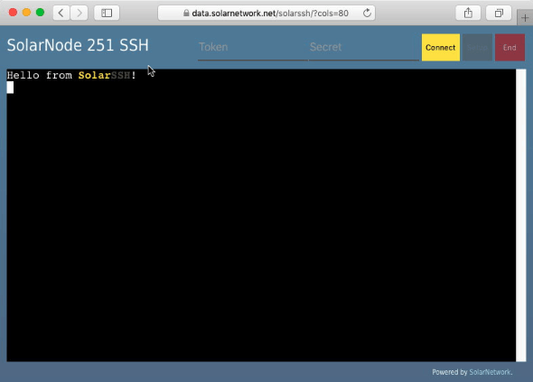

# SolarSSH Web Terminal

> :warning: This project has been moved to the
> [SolarNetwork/solarssh-webterminal](https://github.com/SolarNetwork/solarssh-webterminal)
> repo. No further changes will be made here.

This project contains a webapp that connects to a [SolarSSH][solarssh] server and
initiates a browser-based terminal session to a SolarNode.

Here's a demo of how this webapp can be used to establish a shell terminal on a SolarNode:


The webapp also sports a handy button for launching a new window with the SolarNode Setup
GUI, using the SolarSSH HTTP proxy:


This webapp can be loaded from anywhere, even from your local computer if you download the
source. It uses the [SolarSSH][solarssh-api] and [SolarNet][solarnet-api] APIs to
accomplish everything.

# Use

You can choose the node ID to connect to either by adding a `nodeId=X` URL query parameter
or simply click on the node ID in the page header to edit that to any value. Be aware that
changing the node ID requires closing any open session. You must finish editing the node
ID before it will take effect. Just press <kbd>Tab</kbd> or click on something else.



Once you've configured the node ID to connect to, fill in the SolarNetwork **user token**
credentials that have access to that node and click the **Connect** button. SolarSSH will
immediately prompt you for the node OS SSH credentials to use. You can fill those in now,
or press the **Skip** button if you only want to use the HTTP proxy feature.

It can take a few minutes for the connection to be established, depending on how the node
has been configured.

# URL parameters

You can pass some URL parameters to the webapp to modify a few things:

<table>
	<tr>
		<th><code>nodeId</code></th>
		<td>This one is pretty much necessary. Sets the ID of the node you want to control.</td>
	</tr>
	<tr>
		<th><code>cols</code></th>
		<td>The number of columns to use in the terminal. Defaults to <code>100</code>.</td>
	</tr>
	<tr>
		<th><code>lines</code></th>
		<td>The number of lines (rows) to use in the terminal. Defaults to <code>24</code>. Classic!</td>
	</tr>
</table>

For example, to control node ID 123 using a 80x48 terminal, you'd use a URL like

    index.html?nodeId=123&cols=80&lines=48

# Building

The build uses [NPM][npm] or [Yarn][yarn]. First, initialize the dependencies:

```shell
# NPM
npm install

# or, Yarn
yarn install
```

Then, the development web server can be started via

```shell
# NPM
npm run start

# or, Yarn
yarn run start
```

and then the app can be reached at [localhost:9000](http://localhost:9000). For a
produciton build, use

```shell
# NPM
npm run build -- --config webpack.prod.js

# or, Yarn
yarn run build --config webpack.prod.js
```

and the app will be built in the `dist` directory.

# Development

This app uses the [SolarNetwork Core library][sn-api-core] for [working with the SolarNet
API][core-api-imports], and provides a good demonstration of how classes like
[AuthorizationV2Builder][auth-builder] is used for generating [SNWS2][snws2] authorization
headers. The [SolarNetwork SSH library][sn-api-ssh] is [also used][ssh-api-imports],
making [heavy use][sshurlhelper-use] of the [SshUrlHelper][sshurlhelper] and
[SshSession][sshsession] classes to [easily][ws-auth] [work][term-settings]
[with][sess-json] the SolarSSH API.

[npm]: https://www.npmjs.com/
[yarn]: https://yarnpkg.com/
[solarssh]: https://github.com/SolarNetwork/solarnetwork-mysolarnode/tree/develop/solarssh
[solarssh-api]: https://github.com/SolarNetwork/solarnetwork/wiki/SolarSSH-API
[solarnet-api]: https://github.com/SolarNetwork/solarnetwork/wiki/API-Developer-Guide
[sn-api-core]: https://github.com/SolarNetwork/sn-api-core-js
[sn-api-ssh]: https://github.com/SolarNetwork/sn-api-ssh-js
[auth-builder]: https://github.com/SolarNetwork/sn-api-core-js/blob/master/src/net/authV2.js
[d3-request]: https://github.com/d3/d3-request
[snws2]: https://github.com/SolarNetwork/solarnetwork/wiki/SolarNet-API-authentication-scheme-V2
[sshurlhelper]: https://github.com/SolarNetwork/sn-api-ssh-js/blob/master/src/net/sshUrlHelperMixin.js
[sshsession]: https://github.com/SolarNetwork/sn-api-ssh-js/blob/master/src/domain/sshSession.js
[core-api-imports]: https://github.com/SolarNetwork/solarnetwork-mysolarnode/blob/17dc55859fcf88f12c77f200641fffaf5335a8e4/solarssh-webterminal/src/solarssh.js#L3-L9
[ssh-api-imports]: https://github.com/SolarNetwork/solarnetwork-mysolarnode/blob/17dc55859fcf88f12c77f200641fffaf5335a8e4/solarssh-webterminal/src/solarssh.js#L10-L17
[sshurlhelper-use]: https://github.com/SolarNetwork/solarnetwork-mysolarnode/blob/17dc55859fcf88f12c77f200641fffaf5335a8e4/solarssh-webterminal/src/solarssh.js#L216-L217
[ws-auth]: https://github.com/SolarNetwork/solarnetwork-mysolarnode/blob/17dc55859fcf88f12c77f200641fffaf5335a8e4/solarssh-webterminal/src/solarssh.js#L395-L402
[term-settings]: https://github.com/SolarNetwork/solarnetwork-mysolarnode/blob/17dc55859fcf88f12c77f200641fffaf5335a8e4/solarssh-webterminal/src/solarssh.js#L68
[sess-json]: https://github.com/SolarNetwork/solarnetwork-mysolarnode/blob/17dc55859fcf88f12c77f200641fffaf5335a8e4/solarssh-webterminal/src/solarssh.js#L109
