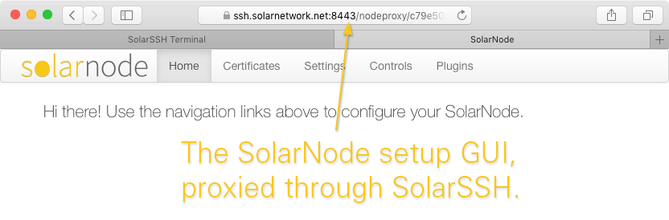

# SolarSSH Web Terminal

This project contains a webapp that connects to a [SolarSSH][solarssh]
server and initiates a browser-based terminal session to a SolarNode.

Here's a demo of how this webapp can be used to establish a shell terminal on
a SolarNode:

The webapp also sports a handy button for launching a new window with
the SolarNode Setup GUI, using the SolarSSH HTTP proxy:

This webapp can be loaded from anywhere, even from your local computer if you
download the source. It uses the [SolarSSH][solarssh-api] and [SolarNet][solarnet-api]
APIs to accomplish everything. The main HTML file to load is the `web/solarssh.html`
file.

# URL parameters

You can pass some URL parameters to the webapp to modify a few things:

<table>
	<tr>
		<th><code>nodeId</code></th>
		<td>This one is pretty much necessary. Sets the ID of the node you want to control.</td>
	</tr>
	<tr>
		<th><code>cols</code></th>
		<td>The number of columns to use in the terminal. Defaults to <code>100</code>.</td>
	</tr>
	<tr>
		<th><code>lines</code></th>
		<td>The number of lines (rows) to use in the terminal. Defaults to <code>24</code>. Classic!</td>
	</tr>
</table>

For example, to control node ID 123 using a 80x48 terminal, you'd use a URL like

	solarssh.html?nodeId=123&cols=80&lines=48

  [solarssh]: https://github.com/SolarNetwork/solarnetwork-mysolarnode/tree/develop/solarssh
  [solarssh-api]: https://github.com/SolarNetwork/solarnetwork/wiki/SolarSSH-API
  [solarnet-api]: https://github.com/SolarNetwork/solarnetwork/wiki/API-Developer-Guide
